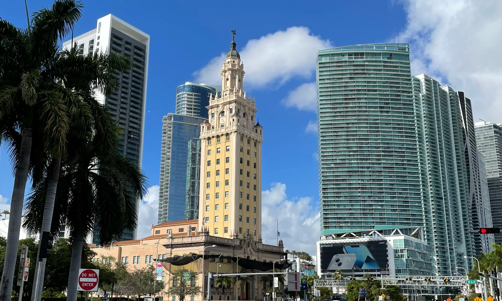
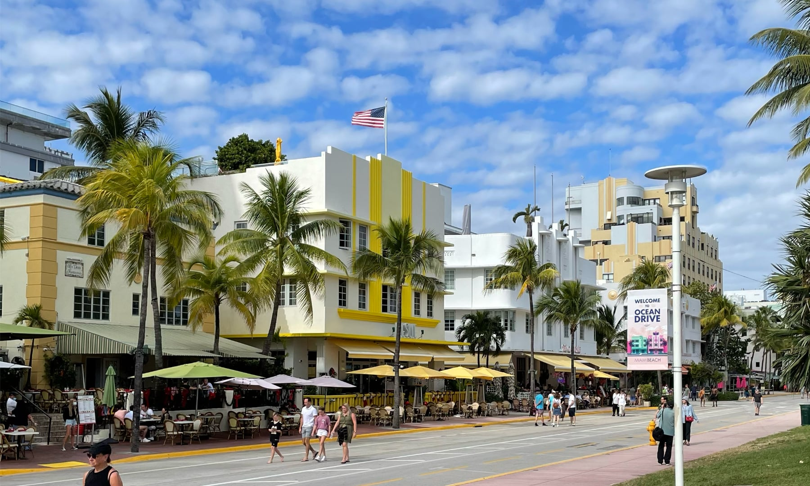
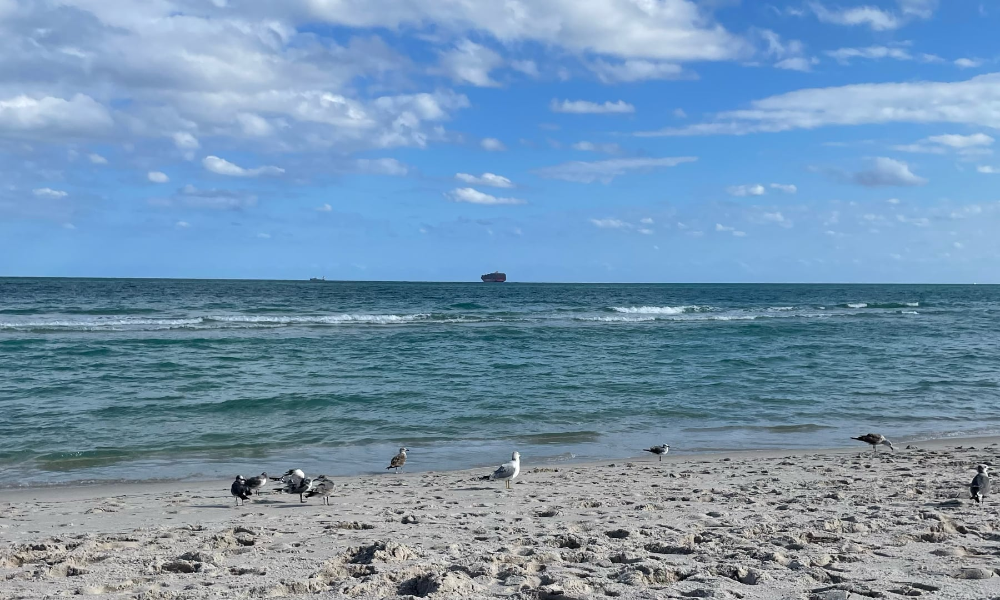
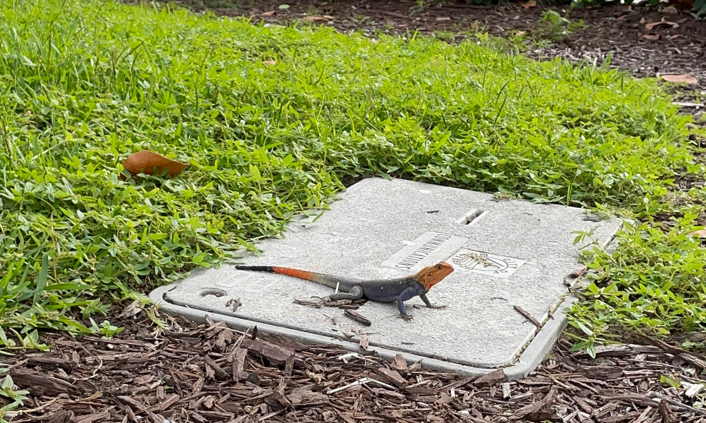

import MiamiMap from "../../components/travel/MiamiMap";

Miami is the eigth largest city in the U.S. by MSA population[^1], but is the third most popular U.S. city for international visitors[^2]. It's a top vacation destination due to its geography in the tropics as well as its proximity to the ocean. Anecdotally, Miami is New York's canonical winter destination to escape from the cold, and Florida the default retirement destination on the East Coast.

Alongside the entertainment that is expected of its accessiblility to the idyllic beaches and parks, it's a modern city with unique character, diverse population, intricate history, and extravagent energy. Respectifully loud electronic music bumping in cafes early in the morning, color liberally used on buildings throughout the city, luscious green spaces with local fauna around the city, and establishments balancing their decor between tastefully moody and playfully camp.

Miami and generally south Florida is interesting from a linguistic perspective too. Miami is a city with 69.4% of its population identifying as Hispanic or Latino[^3] and 63.6% of people surveyed speak Spanish at home[^4]. The city's long standing immigrant history and language usage manifested in a new Miami English dialect[^5], accompanied with vowel and consonant shifts, prosody, and calques. Additionally, its dialect is closer to Midland English rather than the South[^6] despite being geographically the southern most point of the continential U.S..

<MiamiMap />

## How to read

This isn't intended to be a comprehensive travel guide, but more like an outline to as an attempt to explore Miami beyond what is canonically known to tourists. I looked for places and restaurants that add outsized character or cultural representation to the experience of the city, but it's not an emcompassing list of everything to do.

This was initially written prior to the trip with the help of online resources and revised during it, so I don't claim to be an expert. I hope to revisit this in the future and make modifications that can cover most of what Miami can offer within just a few days of visiting. The themes I seeked out are: historical and modern architecture, a perfect beach day, art, museums, and Latin American and Haitian influences.

## Public transportation options

I generally don't like to travel with a car unless it is absolutely necessary. These are in descending process of elimination, as in if I can't take the first option, I'll go down the list until one makes sense.

- Bus - I actually used the bus a considerable amount of times during my visit. I found them to be direct and somewhat reliable with 5-10 minute service intervals depending on how touristy the area is. Especially on Miami Beach where traffic is heavy, they might even be as fast as what you'd get on ridesharing.
- Metromover - This is a free people mover lines that runs around downtown Miami, which is low effort and fun to hop on for sightseeing. Unfortunately it doesn't go very fast or far, so it's mostly novelty aside from using it to go around downtown.
- Trolley - These buses are what I presume to be literally made for tourists, given their faux trolley body. They're free to ride (good), has a ton of stops (possibly bad), and comes at 15-45 minute intervals depending on the route (bad). Buses sometimes share the same route as trolleys, which is why I assume it can get away with being infrequent.
- Ferry - If you wanted a boat experience without renting a private one, you could take the Poseidon Ferry limited Commuter Service between downtown Miami and the east side of South Beach for $10 one way. This is purely style points as the bus will take you between the terminals in about the same time. It does serve alcohol.
- Metrorail - The rail costs money to ride, but it doesn't really connect to the neighborhood visitors want to check out for the first time. It connects to the airport via an airtrain, so unless you're not pressed for time and want to ride it for fun, it's really best avoided.
- Taxi or ridesharing (Lyft, Uber) - These are generally available, although you may be subject to surge pricing in certain areas like downtown Miami or South Beach depending on time and day (harder to find and more expensive after dinner and presumably after nightlife winds down). These are obviously expensive and can be 5-20x the cost of other options.

## Stack rank of tourist activities

Each of these groupings should be roughly one day's worth. I'd visit these places in the order from top to bottom, then if you're staying for more days, revisit the parts that stood out, or pick a random place from notable mentions.

### 1. South Beach

South Beach and Ocean Drive is probably most iconically known as the Spring Break destination. Beaches of pale white sand against clear-ish bluegreen ocean water, and blocks of beachfront restaurants and bars. It's also known for its colorful art deco architecture, landing it a spot on the U.S. National Register of Historic Places. 

Activities:

- Miami Beach (outdoors, beach)
- Ocean Drive (outdoors, art deco architecture)
  - _The places here are mostly catered to tourists. The Clevelander (outdoor bar with neon decor) and Palace Bar (LGBTQ and drag) appears to be longstanding establishments that could be worth dropping in if they look interesting to you._
- Española Way (outdoor options, Spanish revival architecture lined with $30-50/person person restaurants)
- Sunset Harbour (outdoor options, less-touristy restaurants)
- Miami Beach Botanical Garden (outdoors, garden)
- The Betsy Orb (outdoors, weird overhead orb art display)
- Lincoln Road (outdoor options, restaurants, bars, shops, occasionally some farmer's market and street food stalls)
- World Erotic Art Museum (indoors, museum)
- The Bass Museum of Art (indoors, museum)

Restaurants:

- Mercato della Pescheria (outdoor options, $45/person, Italian)
- Taquiza (outdoor options, $15/person, fun tacos with black-colored tortillas)

### 2. Downtown Miami, Brickell, Little Havana

Downtown and Brickell are Miami's modern high-rise area. Take the free Metromover around to take in Miami's take on skyscrapers. Scattered around the area are a few fun historic buildings. Nearby is Little Havana, the historic neighborhood of the Cuban diaspora, filled with Latin-inspired restaurants and establishments.

Activities:

- Freedom Tower at Miami Dade College (outdoor options, architecture)
- Miami Tower (outdoor options, architecture, see at night for LEDs)
- Brickell Avenue Bridge (outdoors, drawbridge)
  - _The bridge on South Miami Avenue is also a drawbridge, but you can watch the boats pass by in the Brickell Point park, which is way nicer imo._
- Miami Circle at Brickell Point (outdoors, archeological site)
  - _ngl this was very underwhemling as the circle has been mooooodernized, literally covered up with railings and plants. I really wasn't sure what I was looking at_
- Vizcaya Museum & Gardens (outdoor options, museum, historic estate)
- Security Building (outdoor options, architecture)
- Calle Ocho (outdoors, historic Cuban immigrant commercial street)
- Futurama 1637 Art Building (outdoor options, architecture)
- Tower Theater (outdoor options, architecture)

Restaurants:

- South Miami Avenue has wide range of bars and restaurants
- Dolores but you can call me Lolita (outdoor options, $40/person, New American, rooftop)
- Novecento (outdoor options, $30/person, Argentinian)
- Garcia's Seafood Grille & Fish Market (outdoor options, $30/person, seafood, riverfront views)
- Versailles Restaurant Cuban Cuisine (indoors, $15/person, Cuban)
  - _"The World's Most Famous Cuban Restaurant"_
- Azucar Ice Cream - Little Havana (takeout, $10/person, ice cream)

### 3. Design District, Wynwood, Little Haiti

Slightly further uptown is a few different neighborhoods that offer different vibes. The Design District is filled with MoMA-esque high fashion art galleries and big name designers (Christian Louboutin, Burberry, etc.). Wynwood offers a relatively laid back hipster art experience, complete with street murals and graffiti art. Little Haiti is the historic Haitian immigrant neighborhood that offers cultural and artistic experiences.

Activities:

- Jungle Island (outdoors, zoo)
- Pérez Art Museum Miami (outdoor options, museum, giant head statue)
- Wynwood Walls (outdoors, street art)
- The Margulies Collection at the WAREhOUSE (indoors, museum)
- Little Haiti Cultural Center (outdoor options, museum)

Restaurants:

- Panther Coffee (outdoor options, $10/person, coffee)
- Chef Creole Seasoned Restaurant (outdoor options, $30/person, Creole)
- Buena Vista Deli (outdoor options, $10/person, French breakfast and brunch)

### 4. Virginia Key, Key Biscayne

These smaller offshoot islands have cool public parks and beaches, great for a day of leisuring and outdoor activities. Depending on your fitness tolerance or interest, this might be a shorter day, so consider hopping back to nearby downtown to do more exploring.

Activities:

- Bill Baggs Cape Florida State Park (outdoors, lighthouse, beach, park)
- Virginia Key Outdoor Center (outdoors, paddleboard and kayaking with city views)

Restaurants:

- You should be able to find some casual food options, but you might be better off packing your own lunch for the mini-excursion. It's a good time to visit Publix, a grocery chain based in Florida that looks to be highly favored by locals[^7].

### Notable mentions

If for some reason you ran out of things to do, here are some more excursions that seems interesting but were too far away to make a comprehensive car-free, ridesharing-minimal day of activities.

- Coral Castle (outdoors, sculpture garden built by a literal skinny legend[^8])
- The Kampong, National Tropical Botanical Garden (outdoor options, botanical garden)
- Monkey Jungle (outdoors, subtropical eco park, monkeys)
- Visit the neighborhood of Coral Gables, which also has the public Venetian Pool, built out of a rock quarry and furnished in the Mediterranian Revival style.
- Take a three hour bus ride down south for a day trip at Key West, the southern most point of the continential U.S..
- North Beach is filled with resort-style hotels and aesthetically pleasing restaurants, but not much else within walking distance. The beach in the area is less populated and some private pools look nice, but if you're not living in one of the hotels I'd opt out of visiting this area.
- For the naturist-inclined, Haulover Beach is Florida's most well known and oldest clothing-optional beach, located north of Miami Beach.

[^1]: https://www.census.gov/library/visualizations/interactive/2020-population-and-housing-state-data.html

[^2]: https://newsroom.mastercard.com/wp-content/uploads/2016/09/FINAL-Global-Destination-Cities-Index-Report.pdf, page 47

[^3]: https://www.census.gov/quickfacts/fact/table/miamidadecountyflorida/POP060210

[^4]: https://www.census.gov/data/tables/2013/demo/2009-2013-lang-tables.html Detailed Languages Spoken at Home and Ability to Speak English for the Population 5 Years and Over for Counties: 2009-2013

[^5]: https://www.wlrn.org/radio/2013-08-26/miami-accents-how-miamah-turned-into-a-different-sort-of-twang

[^6]: https://aschmann.net/AmEng/#SmallMapUnitedStates

[^7]: https://www.sun-sentinel.com/features/deals-shopping/fl-bz-consumer-reports-2019-best-grocery-stores-20190430-story.html

[^8]: https://coralcastle.com/ "[...]built by one man, Edward Leedskalnin. From 1923 to 1951[...]man weighing a mere 100 pounds[...]"
