A normal person generally wouldn’t even think about their photo collection twice. I tend to forget a lot of details when I recall memories, so I get a fun kick out of looking back at old photos. I’d say I strongly care about the photos I’ve taken over the years.

I’ve initially used Google Photos back in the day from when it was originally released, then moved to iCloud Photos some time in 2020 because I had too much time on my hands and I was fully bought into the Apple ecosystem.

Nothing is forever though. I bought a small Android phone, specifically the YouTube/TikTok famous flip phone Samsung Galaxy Folder2, and would like to access and back up photos on non-Apple devices. It’s a cool piece of dying technology and it’s really neat that it’s mostly functional despite the outdated software and hardware.

The task is migrating about 393 gigabytes of photos and videos to Google Photos. From the length of this article, you can ascertain this was not an easy task.

## Attempt 1: Use Apple’s transfer feature on their data privacy site

If you look up “iCloud Photos to Google Photos”, you’ll find [this link to an Apple Support page that will do exactly what I want](https://support.apple.com/en-us/HT208514). If it was this easy there would not be a long blog post about it.

The site allowed you to get a copy of your data or transfer it.

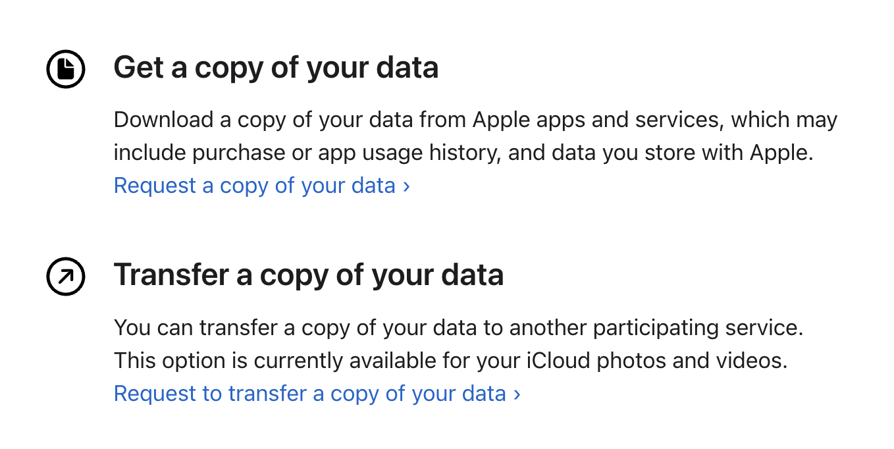

I requested to do both, which came in handy when the transfer ultimately failed to retain timestamps correctly. At this point, I didn’t dig too deeply into what kind of files failed to retain those timestamps, but it was obvious something was wrong. I noticed my Snapchat backups were in the wrong order (which also didn’t save timestamps when exporting out of the app and required me to painstakingly re-timestamp two years of content). A lot of videos and screenshots were also in the wrong order.

I abandoned relying on the transfer service and tried something else.

## Attempt 2: Open up Google Photos and let it back up photos

The next approach involved using the Google Photos app on my spare iPad. From early testing, it all seemed to work as expected. It was backing up older pictures, including ones from years ago. This work well until the Google Photos app froze on backing up. Usually, the backup progress bar looks like this:

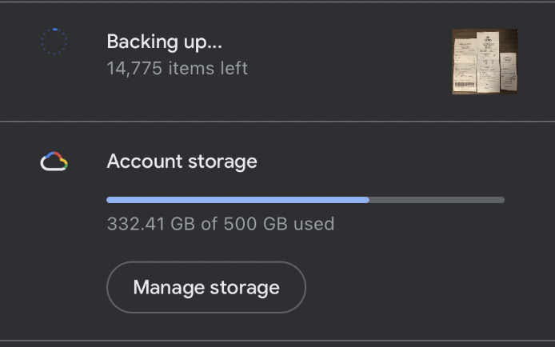

Notice the image on the right that indicates the image it is backing up. At around 270 gigabytes, the app stopped backing up entirely. The number of items left froze and the image on the right no longer showed up.

Thinking the dedupe feature would work correctly (a mistake) and having made the iCloud copy earlier, I started destructively deleting photos from iCloud Photos using Google Photos’ “delete from device” feature. It seemed to restart backing up again until it froze again. After deleting about 30,000 photos, I realized the app was recommending me to delete files that weren’t backed up yet. That’s when I stopped this approach.

## Attempt 3: Download the copy, relabel the timestamps, and upload it manually to Google Photos

Now that some of my photos were deleted from iCloud and only stored within the downloadable copy, I went ahead to download all of the parts from Apple’s privacy site. I chose the 25 gigabyte sized ZIP parts for download, and it gave me 19 parts to download. 

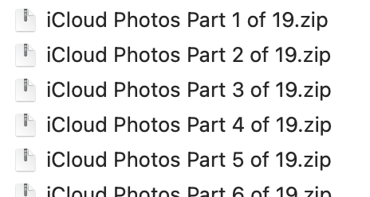

For some odd reason, I was never able to download part 7 fully, so there’s ~25 gigabytes of data missing. I hope the backups from the second attempt correctly saved the pictures, because otherwise it is lost to the void forever. Each part contained about 25 gigabytes of media.

I tried uploading one of the parts and there were some immediately obvious issues with the timestamps. It looks like it’s just doing the same thing as the migration tool.

- Some PNGs and video files did not have any timestamps or metadata. This meant screenshots and images that did not support metadata just used the file creation date, which is the time I unzipped the ZIP (useless).
- Some live photos were not correctly combined with their JPG/HEIC counterparts, resulting in the MOVs having the wrong timestamp while their counterparts correctly saved to the right timestamp.

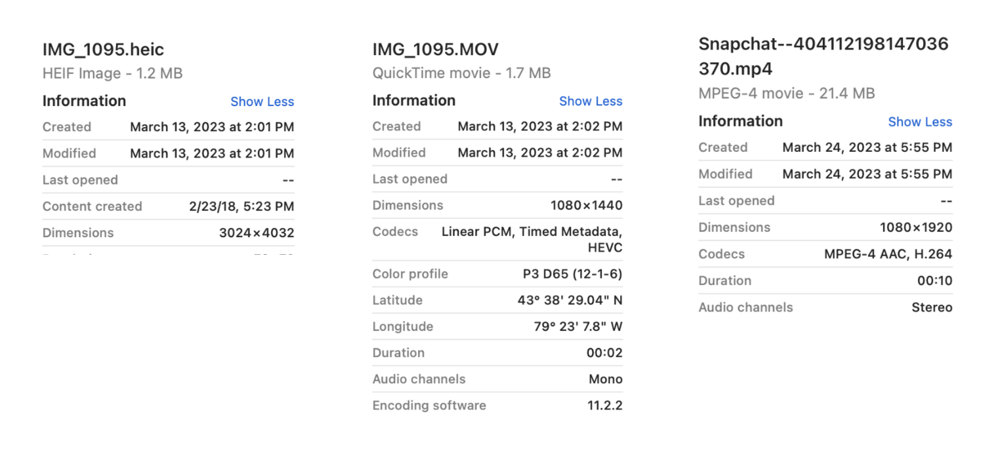

Digging into the ZIPs, there are Photo Details CSV files also separated in parts.


Opening up one of them, it looks like this (truncated). And if I compare the originalCreationDate to the file with the missing timestamps, it still retained them in these file!

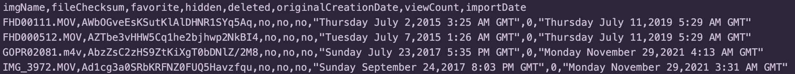

This is exactly what I needed to migrate my photos library in the right order. I just need to follow these steps:

1. Upload a ZIP part
2. Find all of the images with wrong timestamps
3. Find the right timestamp from the CSVs
4. Update it in Google Photos
5. Rinse and repeat until I upload all of the parts

Well, on the first ZIP part, turns out there’s about 100+ mislabeled photos. Along with the CSVs split into so many parts, I had to `Cmd + F` the image name with dozens of files open.

A normal person would’ve given up here, taken the L, and backed up all of the photos anyways with the wrong timestamp. Well, I’m a software engineer with free time and sufficient desperation to get this problem right. Since we live in 2023, the Age of LLMs, I asked Bard to write me a Python script to combine all of the CSV parts into one large CSV. The scripts weren’t perfect but it sure saved me a lot of time on fiddling with one that worked. I really didn’t want to code anything for this effort given I’ve already spent weeks on and off on the previous steps. Code quality didn’t matter because I’m never going to reuse these scripts once I’m done.

```python
# csv_script.py
import os
import glob

# Open the output file
with open("combined_csv.csv", "w") as outfile:
    # Iterate through all CSV files in the directory
    os.chdir("iCloud Photos Part 1 of 19/Photos")
    for i, filename in enumerate(glob.glob("*.csv")):
        print("Working on file: " + filename)

        # Open each CSV file and remove the first line
        with open(filename, "r") as infile:
            if i == 0:
                lines = infile.readlines()
                outfile.writelines(lines)
            else:
                lines = infile.readlines()[1:]
                outfile.writelines(lines)

print("CSV files combined successfully!")
```

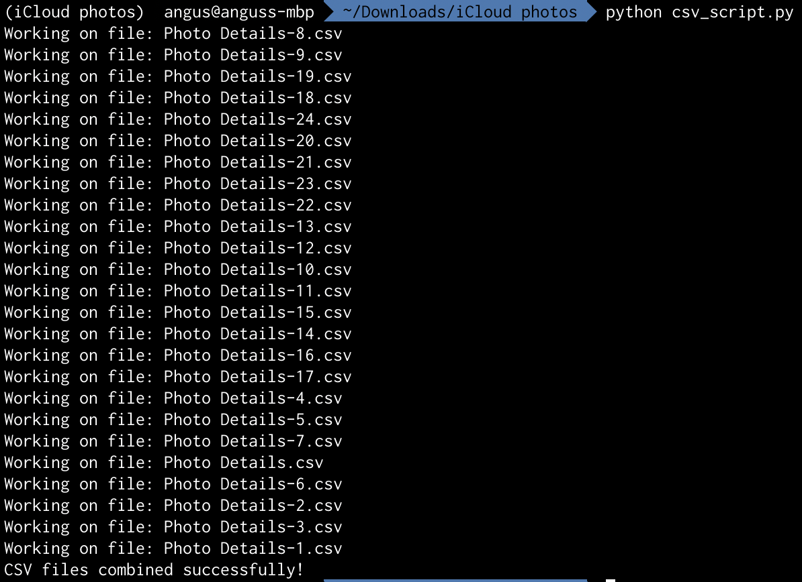

This first script solved the problem of finding the right timestamp, solving step 3. However, doing step 4 for each image sucked so bad I wanted to cry. Here’s a screen recording of me going between Google Photos and the CSV to update the timestamps.

It’s time for a new script to bulk update the timestamps on the files. I tried to update the actual HEIC metadata on the files using Pillow (PIL), but turns out it didn’t support movie files and sometimes the metadata didn’t save correctly. I pivoted to updating the actual created and modified timestamp on the files, which was consistent for all filetypes. This is what the commands look like on macOS.

```python
# Update creation date 
SetFile -d '01/31/1970 00:00:00 AM' path_to_file_here

# Update modified date
SetFile -m '01/31/1970 00:00:00 AM' path_to_file_here
```

The next script I wrote was a dry-run version of iterating over each non-CSV file in the ZIP part, find the file’s row in the combined CSV, and run these commands on the file. This is when I discovered my next issue. There are duplicate file names.

If a file was backed up on iCloud Photos with the same name, it won’t rename the file until it is exported. This isn’t a problem until you’re migrating to Google Photos. files with a duplicate file name will get a `-1` appended to the end of the name before the filetype, but not in the CSV.

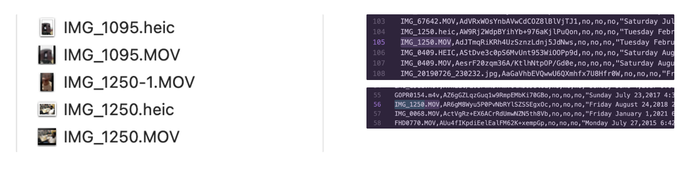

Perhaps this point is moot if I can get compare the checksums of the image to the rows in the CSV, but I actually couldn’t figure out the checksum format. It looks like a Base64 hash, but comparing the Base64 hash of the file with the checksum in the CSV with a unique filename yielded different values. I tried looking it up online but it seems like there’s no documentation about this value.

So, I’ll have to go manually correct the filename in the CSV by examining which CSV values have duplicate names, find them in the folder, recall in my memory which timestamp is more likely for which picture, then update the filename in the CSV. I wrote this script to help me find duplicates:

```python
# validate_csv.py
import csv

csv_hash = {}

# Open the CSV file
with open("combined_csv.csv", "r") as csv_file:
    csv_reader = csv.reader(csv_file)
    for row in csv_reader:
        filename = row[0]
        creation_date = row[5]

        if csv_hash.get(filename):
            print(filename + ' has a duplicate. The new date is ' + creation_date + ' but the old one is ' + csv_hash[filename] + '.')
        else:
            csv_hash[filename] = creation_date
```

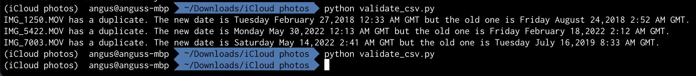

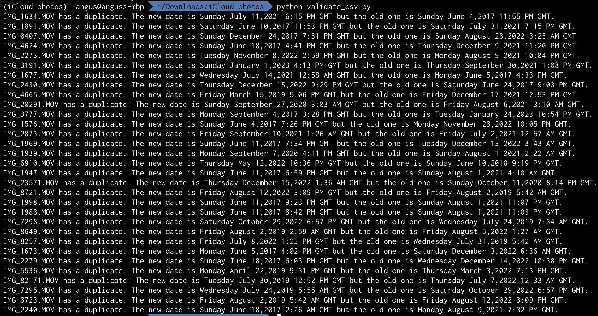

Each ZIP part can contain up to 200 instances of duplicate filenames for my photos, with usually only 2 images to choose from between each duplicate filename. This is a lot more reasonable to manually correct. Once I’ve made the adjustment, I can run the script again to make sure it no longer has duplicates.

Finally, I can actually update the timestamps on the files and upload it to Google Photos. The timestamp format and timezone took a little bit of fiddling too, because the CSV had weird values. I think it subtracted an Eastern Time offset for my photo’s timestamps, but I couldn’t get the timestamps to line up consistently. 

I eventually gave up on trying to get the hours to line up perfectly since the minutes on the CSV’s creation time didn’t match up with the files that did retain metadata. I figured it’s okay since the media that originally had missing timestamps with new timestamps that are only off by a few hours is within an error margin I’m willing to tolerate. Plus, the `SetFile` corrected timestamps are a no-op for media with EXIF metadata.

```python
# fix_timestamps_script.py
import csv
from datetime import datetime
import os
from pytz import timezone, utc
from subprocess import call

est = timezone('US/Eastern')

csv_hash = {}
# Open the CSV file
with open("combined_csv.csv", "r") as csv_file:
    csv_reader = csv.reader(csv_file)
    for row in csv_reader:
        filename = row[0]
        creation_date = row[5]

        if csv_hash.get(filename):
            print(filename + ' has a duplicate. The new date is ' + creation_date + ' but the old one is ' + csv_hash[filename] + '.')
        else:
            csv_hash[filename] = creation_date

# Get the path to the files
image_dir = "iCloud Photos Part 1 of 19/Photos"
all_files = os.listdir(image_dir)

for file in all_files:
    # Ignore irrelevant files
    if file.lower().endswith('.csv'):
        continue

    to_dir = os.path.join("iCloud Photos Part 1 of 19", "Photos", file)

    creation_date = csv_hash.get(file)
    if not creation_date:
        print(file + " is missing a timestamp, skipping.")
        continue

    datetime_object = datetime.strptime(creation_date, "%A %B %d,%Y %H:%M %p %Z")
    offset_dt = datetime_object.replace(tzinfo=est).astimezone(utc)

    exif_formatted_date = offset_dt.strftime("%Y:%m:%d %H:%M:%S")

    call('SetFile -d "' + offset_dt.strftime('%m/%d/%Y %I:%M:%S %p') + '" "' + to_dir + '"', shell=True)
    call('SetFile -m "' + offset_dt.strftime('%m/%d/%Y %I:%M:%S %p') + '" "' + to_dir + '"', shell=True)

print("Done.")
```

Finally, after running this script, I can finally upload the folder to Google Photos through the website. Google Photos will try to dedupe exact copies of photos and videos, so I’m not worried about filling my library with a ton of duplicates. Even if there were duplicates, it’s better that they’re in the library with the correct timestamp.

## New challenge with shared albums

I thought it’s all smooth sailing from here on out, continuing the same strategy until I reached the 19th ZIP part. Turns out, there’s a new curveball with iCloud’s shared albums. The pictures placed in shared albums seem to be unique and not duplicated in the previous parts, so I couldn’t disregard the pictures.

I had three parts that contained shared albums. Each ZIP part looks like this, with more parts separated into albums. 

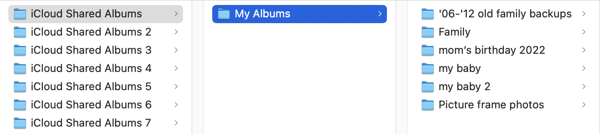

Pictures with live photos were not stored in the same part, and somewhere floating in each of these album folders contained an `AlbumInfo.json`. It was in a format that looked like this: 

```python
{
  "albumName": "Family",
  "creationDate": "Monday August 17,2015 12:52 PM GMT",
  "allowContributions": true,
  "isPublic": false,
  "owner": {
    "fullName": "Angus Lam",
    "appleid": "REDACTED"
  },
  "photos": [
    {
      "name": "IMG_0003.JPG",
      "dateCreated": "Friday January 8,2021 1:16 AM GMT",
      "contributor": {
        "fullName": "Myra Lam",
        "appleid": "REDACTED"
      },
      "comments": []
    },
    {
      "name": "IMG_0001.JPG",
      "dateCreated": "Friday January 8,2021 5:52 PM GMT",
      "contributor": {
        "fullName": "Myra Lam",
        "appleid": "REDACTED"
      },
      "comments": []
    },
		...
  ],
  "participants": [
    {
      "participant": {
        "fullName": "Myra Lam",
        "appleid": "REDACTED"
      },
      "sharingDate": "Saturday January 23,2016 10:16 PM GMT",
      "sharingStatus": "subscribed"
    },
    {
      "participant": {
        "fullName": "Angus Lam",
        "appleid": "REDACTED"
      },
      "sharingStatus": "owned"
    },
		...
  ]
}
```

Similar to the non-shared album parts, some photos had their timestamps missing from the file’s metadata. There were about 1900. To reduce the complexity of the scripts I had to write, I first manually deduped the folders so there’s only a single folder containing all of the files that belonged to the album. 

While combing through the JSON file, there were also duplicate filenames. Pain.

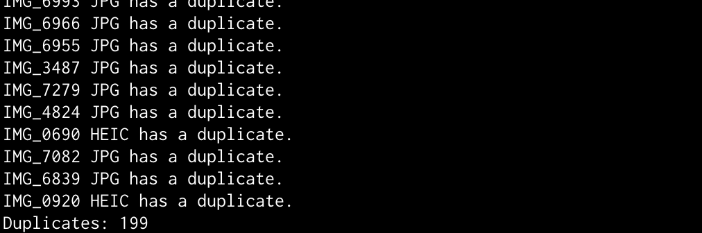

If there is a duplicate original filename, the file also received an incremental numerical suffix. Unsurprisingly, the JSON file did not apply the same file renaming logic, and opted to just tack on a number instead of applying the same behavior from previous ZIP parts. Notably, this file did not include a checksum, so it hints to me the checksum in the previous CSV meant nothing. Luckily, a decent amount of images still retained the EXIF data and will retain the right timestamp on Google Photos. I’m hoping this will cut down having to dedupe.

```python
# find_missing_exifs.py
from exif import Image
import os

image_dir = os.path.join("Shared Albums", "my baby")

count = 0

# Get the path to the files
all_files = os.listdir(image_dir)

for file in all_files:
    # Ignore irrelevant files
    if file.lower().endswith('.json'):
        continue
    
    # MOV or MP4 has no metadata
    if file.lower().endswith('.mov') or file.lower().endswith('.mp4'):
        print(file)
        count += 1
        continue

    with open(os.path.join(image_dir, file), 'rb') as image_file:
        exif_image = Image(image_file)

        try:
            exif_image.datetime
        except AttributeError:
            print(file + " has no datetime EXIF")
            count += 1
        

print("Done. Count: " + str(count))
```

This left me with 192 images. 7 fewer is better I guess. Another curveball is the filename in the JSON file did not match the ones in the folder. The actual file was truncated to 29 characters before the filetype, while the JSON file retained the entire original filename.

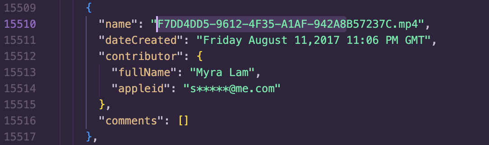

Some of these were actually duplicate files, so straight up removing them was straightforward. Unlike most of the images I had to correct previously, a significant amount of them also shared the same timestamp, so simply checking if the timestamps were identical cut down a ton of work too.

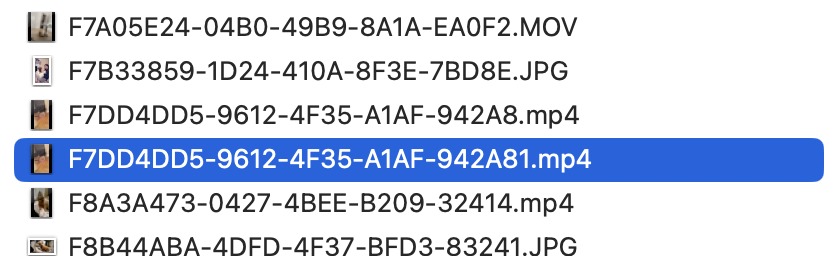

Now this is where I’m at:

- Narrowed down to all files with no EXIF timestamps
- Truncated filenames from the JSON file longer than 33 characters to match the names of the actual files
- Removed duplicates

It’s time to do a dry run of the correction script on the remaining files missing EXIF data!

```python
# fix_shared_album_timestamps_script.py
import json
from datetime import datetime
import os
from pytz import timezone, utc
from subprocess import call

est = timezone('US/Eastern')
image_dir = os.path.join("Shared Albums", "my baby")

# Get the path to the files
missing_timestamps = [
	'EAE1066D-7A3E-4D1E-948F-D51FB.MOV',
	'EC39ADC0-E238-4B09-8FA3-9EB87.mp4',
	'IMG_1208.MOV',
	...
]

datetime_hash = {}
# Open the CSV file
with open(os.path.join(image_dir, "AlbumInfo.json"), "r") as json_file:
    json_object = json.load(json_file)

    photos = json_object['photos']

    for photo in photos:
        raw_filename = photo['name']
        creation_date = photo['dateCreated']

        if len(raw_filename) < 32:
            other_date = datetime_hash.get(raw_filename) 
            if other_date and creation_date != other_date:
                print(raw_filename + ' has a duplicate. The new date is ' + creation_date + ' but the old one is ' + other_date + '.')
                continue
            else:
                datetime_hash[raw_filename] = creation_date
        else:
            raw_filename_split = raw_filename.split('.', 1)
            
            filename = raw_filename_split[0][:29] + '.' + raw_filename_split[1]
        
            other_date = datetime_hash.get(filename)
            if other_date and creation_date != other_date:
                print(filename + ' has a duplicate. The new date is ' + creation_date + ' but the old one is ' + datetime_hash[filename] + '.')
            else:
                datetime_hash[filename] = creation_date

for raw_filename in missing_timestamps:
    to_dir = os.path.join(image_dir, raw_filename)

    creation_date = datetime_hash.get(raw_filename)

    if not creation_date:
        alt_version = raw_filename.split(".", 1)[0] + ".JPG"
        creation_date = datetime_hash.get(alt_version)

    if not creation_date:
        alt_version = raw_filename.split(".", 1)[0] + ".HEIC"
        creation_date = datetime_hash.get(alt_version)

    if not creation_date:
        alt_version = raw_filename.split(".", 1)[0] + ".MOV"
        creation_date = datetime_hash.get(alt_version)

    if not creation_date:
        print(raw_filename + " is missing a timestamp, skipping.")
        continue

    # datetime_object = datetime.strptime(creation_date, "%A %B %d,%Y %H:%M %p %Z")
    # offset_dt = datetime_object.replace(tzinfo=utc).astimezone(est)

    # exif_formatted_date = offset_dt.strftime("%Y:%m:%d %H:%M:%S")

    # call('SetFile -d "' + offset_dt.strftime('%m/%d/%Y %I:%M:%S %p') + '" "' + to_dir + '"', shell=True)
    # call('SetFile -m "' + offset_dt.strftime('%m/%d/%Y %I:%M:%S %p') + '" "' + to_dir + '"', shell=True)

print("Done.")
```

I’m left with 86 corrections, vs the 1900 without digging into the pictures.

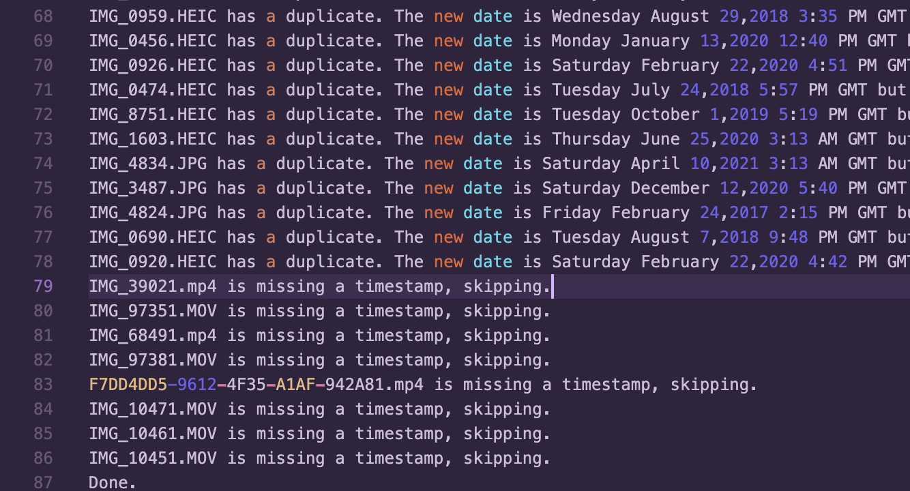

Some images unfortunately also just didn’t have any record in the JSON, so these I have to browse my current library to figure out where they belonged.

## So, did this work?

Everything seemed to look right. My library now has about 420 gigabytes of images and videos, excluding the new ones I’ve taken that were directly uploaded to Google Photos. Did I lose photos? Probably, but there’s no way I’ll be able to tell.

Anyways, I spent probably 80 hours on-and-off across four months on this entire ordeal. Now that I’ve done this process twice, I think between the two platforms, Google Photos has some improved management tools and “memories” features. For the alternative reality Anguses that might come across this post, my advice is just stay put with whatever you started.
