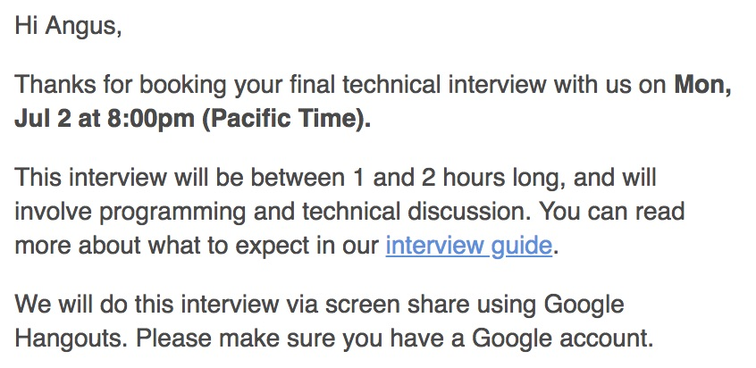
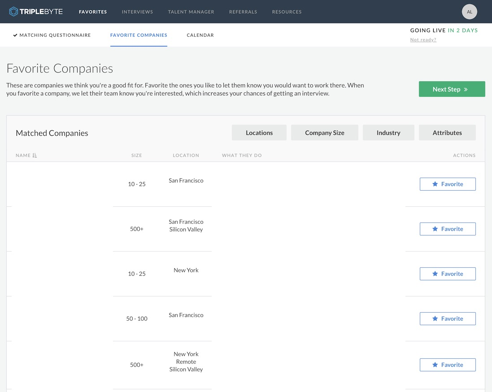
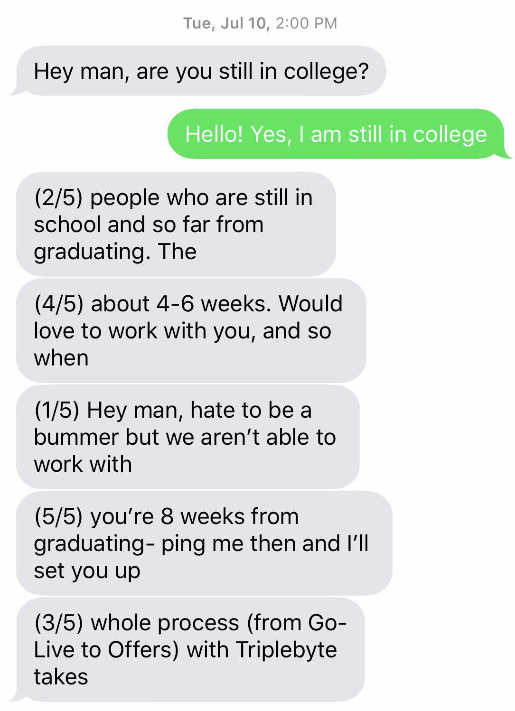

## Preface

So, I'm most definitely not sponsored by Triplebyte. I don't see a lot of third party information on Triplebyte and what their process is like, so I wanted to share my experience. Hopefully this article can shed some light for people who are interested in doing their interviews. I wrote about my experience with Triplebyte in June-July 2018. Things may have changed!

## The Ad
If you're on LinkedIn and/or an avid redditor, you might have seen a couple of these advertisements.

  

Now that sounds pretty good, right? If my algorithms class taught me anything, constant complexity is better than linear complexity.

  

The first thing that stood out is how the quote is unattributed, and these are always funny to me because I'd associate them in my mind as if an important historical figure said it.

> "I think a lot of people still don't realize what a great time investment [Triplebyte] is. [...]" - Abraham Lincoln 2018

Everything sounds great, but it's completely different from how I've been job hunting in tech. 30+ well funded companies scheduling on-site interviews with me after a two hour interview? It sounds too good to be true.

## Research

It would be smart to do some research on Triplebyte before signing up. With how aggressive their ad campaign is, I was pretty wary if they were some sort of job scam ploy for gullible people. Thankfully it looks like the company itself looks legitimate.

1. Although their HQ isn't listed anywhere on their website, it looks like they are based in San Francisco, now on Howard and Beale and previously on 2nd and King.
2. Triplebyte is seeded by Y Combinator (part of the S15 demo class). I don't know much about YC's programs but I guess they are prestigious so there's some form of legitimacy.
3. They have some funding according to Crunchbase[^0] (about $10M at the moment). I guess this is where the ad money came from... 👀
4. I had a coworker that worked at Triplebyte.
5. I'm actually not quite sure if Stripe still uses Triplebyte, but at the very least at one point in the past they were one of the companies advertised on Triplebyte's website[^1].

At this point, I'm pretty confident about the company. Now, of course I couldn't have found all of this information without finding some discussion threads. Namely, there's a lot of negative feedback[^2][^3] on Hacker News.

Generally the comments fell into four categories: 1) skeptics, 2) evangelists, 3) people who had bad experiences with Triplebyte, and 4) the one PR-friendly Triplebyte employee. I suppose people with bad experiences are generally going to be more vocal about it, so I would say the sample here is somewhat skewed. However, I still took the complaints into consideration.

## Sooo... What is Triplebyte?

It looks like Triplebyte made deals with a bunch of tech companies so that Triplebyte conducts the technical interview phone screen. The companies that Triplebyte sources for will 'trust' Triplebyte that they'll only refer quality software engineers. The engineers only need to interview once, the company won't need to spend their own resources to conduct initial sanity-check round of interviews and move the candidate directly to the hiring manager.

I guess you can say Triplebyte is a hiring-as-a-service company. All they need to do is convince companies to trust them, run interviews, then send people over. Save engineers time, save companies money, and when an engineer is placed, make a good chunk of recruitment money. Everyone wins. I get it!

Of course, I'm not Ben Thompson and I'm not trying to figure out how they make money. I'm just interested if the process works and if I, as an engineer, can get a job out of it (spoiler: I didn't, but for a different reason...).

## Why did I do this

I was looking for remote work for after my internship ends since I usually work remotely during the school year. Triplebyte caught my interest because it partners with companies with remote positions.

Another interesting preposition Triplebyte proposes is that your resume is unnecessary and unimportant in the whole process. They’re confident in their interview process for determining if you’re a good candidate or not. This is interesting especially for someone like me with rather unclear years of experience on paper. If I can pass the interview, then Triplebyte will vet me and the companies won't doubt my skills. Also, if I happened to be given an offer that I like better than going back to school, I might just take it. Lastly, if I ended up changing my mind about the idea of dropping out of school, I thought I might be able to land a new grad offer instead.

After a slow and uneventful day in June 2018, I finally decided to take the plunge. I browsed Reddit for a while, then clicked on the conveniently located ad since it basically ran 24/7 on the site anyways.

## Begin the trials

I went on their site and signed up for the quiz. It was advertised to take 25-35 minutes to complete, and it took about that long for me to complete. I was able to choose between general programming, frontend, or mobile as the topic of my interview. I thought the choices were great because I was still in my internship and I didn't really have time to review algorithms and practice HackerRank problems. At that point, I felt more confident with my frontend and full-stack knowledge if I had to do an interview, so I chose the frontend interview.

The quiz is a multiple-choice quiz with a bunch of technical computer science and practical software engineering questions. The questions were quite interesting, falling somewhere between straightforward engineering knowledge and oddly-specific trivia. The quiz felt a little dry and frankly simple, but I also don't know what I would change to improve it. I assume they probably have numbers to prove that it does help them find quality engineers. Otherwise, they'd spend a lot of time and money interviewing engineers only to reject them later on.

I've never been asked these kinds of questions before. My experience with technical interviews up until this point is in the format of internship and new grad interviews (questions almost exclusively in algorithms and data structures). It's a bit of fresh air to have a choice in getting interviewed on something different. I'm going to guess the general programming one is more akin to the DS&A interviews, but I can't speak much about it.

When I finished the quiz, I was told I did "exceptionally well" and am invited to continue onto the technical phone interview.

  

Like I mentioned earlier, I didn't particularity feel like I was able to showcase much of my knowledge in the 30 minute quiz, and being told I'm one of the "top few percent of quiz-takers" leaves me a little unimpressed. But, they sure did do a great job keeping me interested in continuing for the phone screen with this copy:

  

## Next steps

The phone screen is advertised to take about one to two hours to complete, which is pretty standard for most initial technical interviews at competitive tech companies. Triplebyte has a nice scheduler on their website for me to schedule my interview. There are late night interviews for those who are not in Pacific Time or would rather not take time off work to interview. I took advantage of that and scheduled an 8pm-10pm slot.

  

I was told what to prepare for the interview from a guide they emailed me after I scheduled the interview. The interview broke down into three main parts:

1. A practical programming activity using technologies I'm familiar with. I was actually told to prepare any single page application boilerplate I wanted, which means they're more interested in knowing what tools I'm most familiar with.
2. A relatively rapid fire technical trivia game. Think short-answer responses.
3. A long form answer on system design. “How would you build this?”

## Technical phone screen
The technical phone screen is a whole other beast in comparison to the quiz. The interview was very structured and packed with a ton of technical questions. It seemed like the interviewer had to follow a script, got a checklist of questions for the interviewee to answer, and graded performance on a rubric. I suppose this is debatable, but if all the interviews are conducted this way I believe it does help to eliminate bias from the interviewer and puts every candidate on a level playing field.

The first part tested how a candidate performed on programming a well scoped project and was timeboxed into an hour. It’s pretty straightforward and tested your knowledge on frontend (HTML, CSS, JavaScript, your favorite single-page application frameworks and libraries, your preferred method of building them, etc.). This did feel a lot like building a throwaway toy hack, but frankly I think this is a lot more interesting and rather fun in comparison to algorithm puzzles. An aspect about this part of the interview that felt underappreciated is codebase organization. I thought that it would be important for starting new projects, but in the end the challenge is closer to hacking something together rather than creating something foundational.

The second part of the interview is a rapid-fire regurgitation of frontend and general programming facts. You are given series of specific topic and asked to explain what it is, why is it done that way, how it is made, and to compare and contrast. I had the hardest time with this part because of my uncertainty on how to answer the questions. It was the first time was asked to do something like this for an interview. The allotted time for the second and the third part of the interview combined was supposed to take an hour but just the second part took me an hour and a half to wrap up. The sheer amount of questions left me pretty exhausted after this part.

The last part is the system design question. I was given a project idea and some hypothetical resources, then I had to discuss how I’d build the project. The question is straightforward, and I had to specifying the kinds of technologies I’d use to build the given project. I usually would be ecstatic in answering these types of questions, but I didn’t particularly feel very confident at this point of the interview, especially from the previous part. It was 10:30pm at this point and I was really tired from talking.

My interview took three hours long in total. I think the fact that I was the last interview of the day made it easier for the interviewer to choose to continue instead of ending the interview midway (and possibly immediately failing me then and there). The interviewer was very professional and collected throughout my interview, and overall I had a positive experience during the call.

## Interview feedback

A few days later, I received an email from Triplebyte that I passed the interview and I can move forward!

In addition to accepting me to their platform, they also sent me detailed feedback on how I did during my interview. This is the first time I received something like this, so it was interesting to read. I think it is valuable to read and reflect on, especially since I didn't walk out of the interview particularly happy.

```
// Name of specific question in interview replaced with *description of question*

*coding project*: very good
JS knowledge: solid
HTTP knowledge: mixed
Security knowledge: very good
CSS knowledge: very good
Data structures short answer: very good
*system design question*: very good

Angus had a good coding performance, and his knowledge isn't too bad. The biggest problem is he is too precise. He wants to get things correct so you can see the patience in his code as well as his answers. The problem is it ends up taking too long to get anything done.

*coding project* was pretty good. Completed steps 1, 3, 4. He basically got step 2 but he just took too long to complete it. He is a precise coder and he got things done slowly but surely. He had some problems passing functions back and forth because he tried to rely too much on currying. He eventually figured it out, but if he kept things more simple in the beginning he probably could have gotten with no problem.

Short answer was really slow. He takes a long time to speak about things.

JS he knew about promises, but he wasn't really strong on other things like event loop or immutable data.

CSS was good. He had problems listening to questions about specificity. I asked him specific. He knew everything else in CSS to about a 'very good' level.

HTTP was a mix of good and bad. He didn't know anything about caching and he didn't know headers. He did know a lot about security. He knew about XSS and CSRF which is pretty rare.

Algorithms was pretty good. He's a current CS student. He had good information about hashmaps, but he wasn't able to describe things like amortization. Binary search trees was good, but he didn't know the worst case. He knew rotations and he knew how to find the kth element.

*system design question* was okay, he knew the basics of back end. He really shined talking about transpilers. He knew about the pros and cons. He mentioned that they have a large code output which can hurt performance.

His communication was really verbose, sometimes vague and excruciatingly slow. He is a current student who is looking for a job after school.

Angus is a very precise coder and talker. He is knowledgable, but he can come off as unknowledgeable because of delivery. Delivery should be his main focus in prep for interviews.
```

For example, I definitely agree that I’m not the strongest communicator and its something I want to improve on. I could've probably reviewed a bit more. Either way, yay! I did it! It’s all smooth sailing from here right?

## The matching process

The next part is the matching process. I got access to the list of companies that are looking for someone with my skills. The list didn’t contain all the companies that Triplebyte advertised publicly, but I think that’s fine because maybe they might not all be looking for frontend engineers.

The companies I found on the listing range from bigger more established companies to stealthier startups. If you’re down to get any job offer in the area, you’d probably be happy with Triplebyte introducing you to all of these companies. I looked for companies that fit these criteria:

- Remote or based in San Francisco
- Software company with full-stack work
- Company interesting enough that I can see myself working there for 1+ years.
- Uses technologies I like working with (Python, JavaScript, React, etc)
- I saw three companies on there that looked promising. I starred them and waited for Triplebyte to get back to me for the next step.



## Rejected

This is the part where I got offboarded from Triplebyte. Before I continue with the story, I wanted to give an update on how I felt about the whole remote/dropping out of school idea. Long story short, I didn’t feel as strongly about it anymore.

Before the scheduled phone call, I got a text message from Triplebyte:

> Hey man, are you still in school?

Hmm. Strange question since I’ve already said that during the interview and it was written on the interview feedback. Well, regardless of my intentions, I answered the question truthfully. Right after that they said I should reach out again 8 weeks before I graduate.



At this point I took it as a sign to just finish my degree, and didn’t push to continue the progress any further. It was a great experience though.

## Last Words

This is my whole experience with Triplebyte. I hope this provided a good data point for those are interested in interviewing with Triplebyte.

Some final thoughts:

- I obviously haven’t gotten to the onsite portion via Triplebyte, but it seems like to me it’ll be the same as any other onsites in a regular interview process.
- For those looking to find your first job out of school and want to use Triplebyte now to find new grad offers for Summer/Fall 2019, I suggest not wasting your time with Triplebyte and instead apply directly to the new grad positions. Those who are graduating in Winter 2018 might be able to take advantage of Triplebyte.
- For those looking to switch jobs, if you are less picky about the company you want to work at, Triplebyte might be for you. A problem I have with the matching process is that you can’t see exactly what companies are available to you until you pass their two hour interview. That’s pretty lame and a waste of time if none of the companies on there are of interest to you.
- If you don't have a degree and want to find a job through Triplebyte, it might work out for you until the onsites. I think Triplebyte may vet you but companies might still look at resumes. It's worth a shot though.
- As for myself, I don't really have much to complain about the process itself and will probably give them another try in the future.

[^0]: https://www.crunchbase.com/organization/triplebyte
[^1]: https://triplebyte.com/startup/stripe
[^2]: https://news.ycombinator.com/item?id=13831209
[^3]: https://news.ycombinator.com/item?id=16488409
